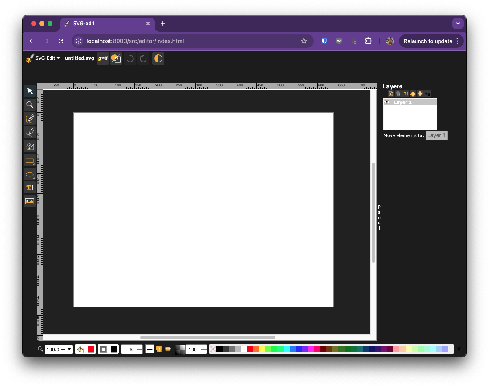
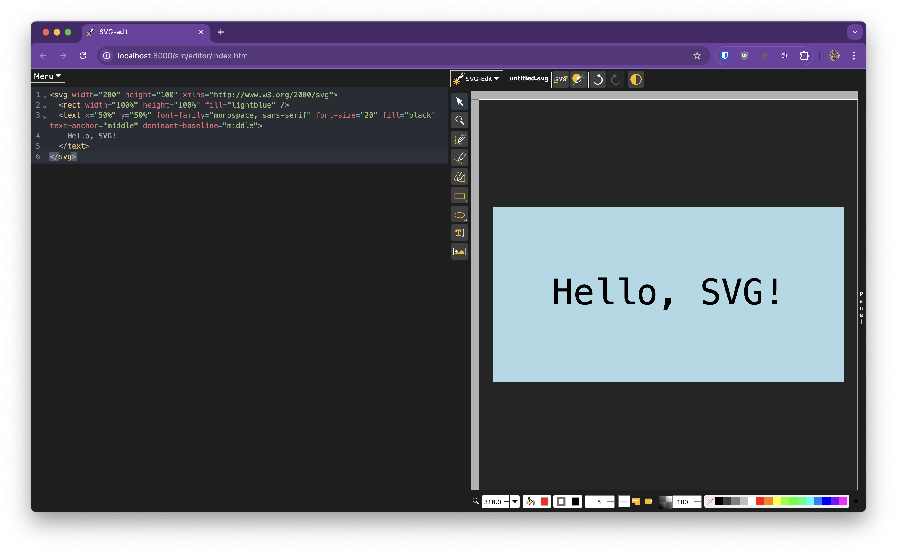

# SVGEdit Extensions

A collection of powerful and user-friendly extensions for [SVG-Edit](https://github.com/SVG-Edit/svgedit), enhancing your vector graphics editing experience.

## Overview

This repository houses a variety of plugins designed to extend the functionality of SVG-Edit, a powerful web-based vector graphics editor. These extensions aim to improve user experience, add new features, and streamline the editing process.

## Extensions

### 1. Dark Theme Toggler (ext-dark-theme)

Allows users to switch between light and dark themes, enhancing visibility and reducing eye strain in low-light environments.

- Easy toggle between light and dark themes
- Customized color palette adapted from the VS Code theme for optimal contrast
- Seamless integration with SVG-Edit

[Learn more about ext-dark-theme](./extensions/ext-dark-theme/README.MD)

### 2. CodeMirror Extras (ext-codemirror)

Adds additional features to the CodeMirror extension, including a view source dialog and a base64 encoder/decoder tool.

[Learn more about ext-codemirror](./extensions/ext-codemirror/README.MD)

## Installation

To use these extensions with SVG-Edit:

1. Clone this repository or download the desired extension folder.
2. Place the extension folder in your SVG-Edit `extensions` directory.
3. Enable the extension in your SVG-Edit configuration.

## Contributing

We welcome contributions to improve existing extensions or add new ones. Please read our [CONTRIBUTING.md](./CONTRIBUTING.md) file for guidelines on how to submit your extensions or improvements.

## License

This project is licensed under the MIT License - see the [LICENSE](./LICENSE) file for details.

## Acknowledgments

- SVG-Edit team for creating and maintaining the core editor
