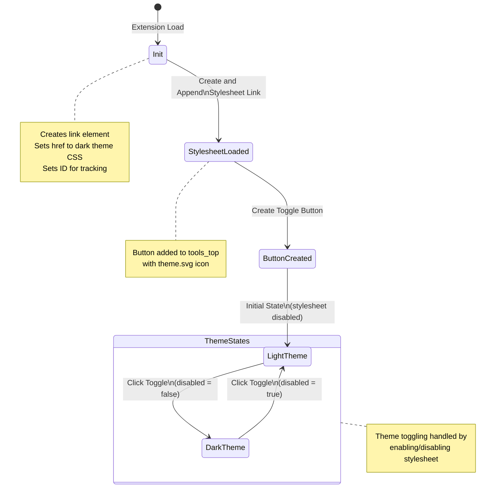

# ext-dark-theme

## Overview

The dark theme extension provides a seamless way to switch between light and dark themes in SVG-Edit. This extension enhances user experience by offering a visually appealing and customizable interface, especially in low-light environments.

## Features

- Easy toggle between light and dark themes
- Seamless integration with SVG-Edit

## Preview

https://github.com/user-attachments/assets/43ae9699-4e20-4fa4-accf-a4207552f2e8

## Author

Hemanta Sapkota <hemanta@yolmo.com> 